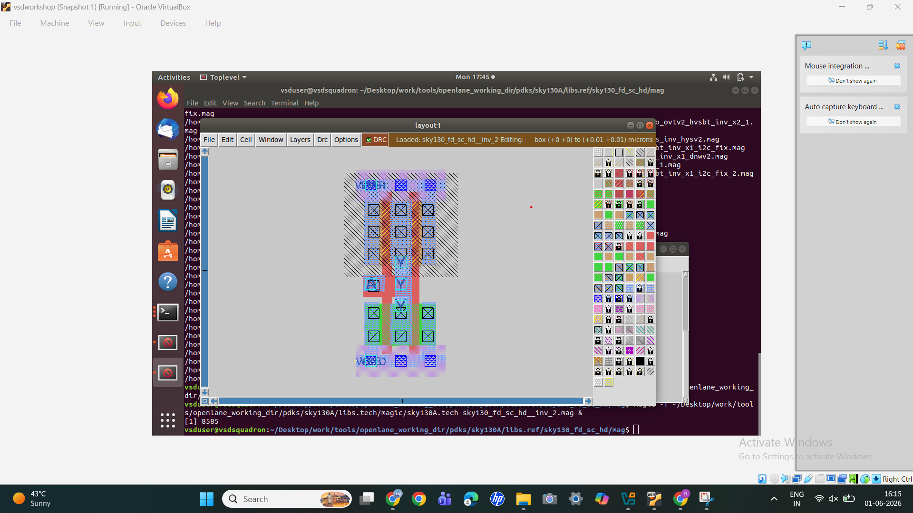
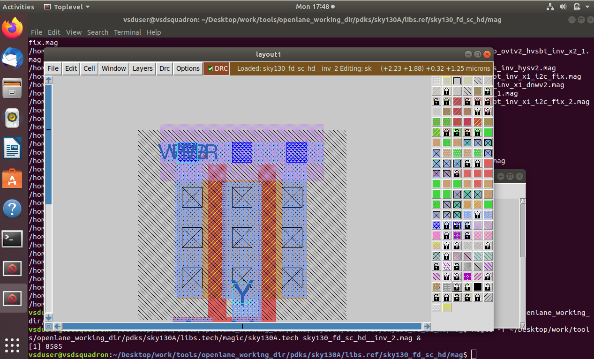
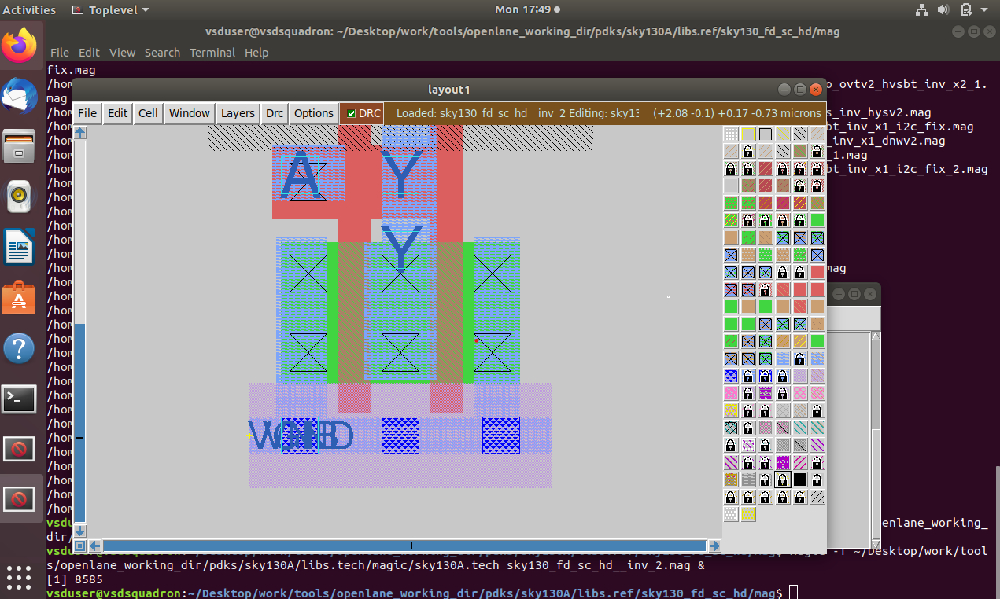
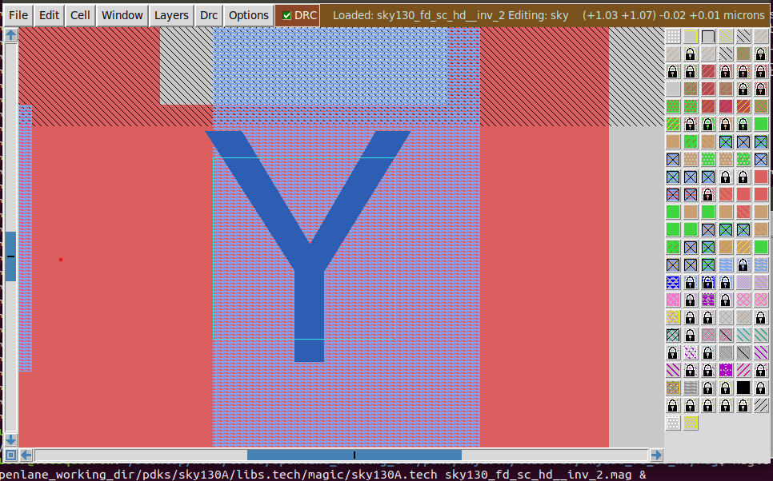
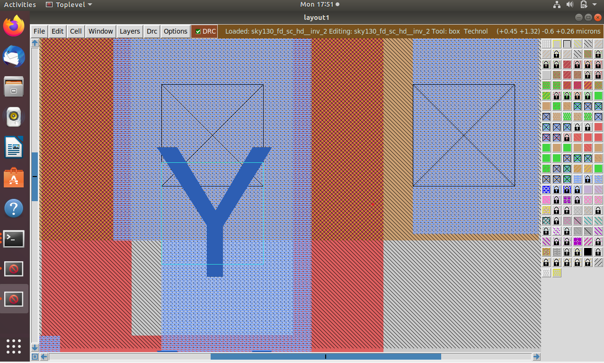
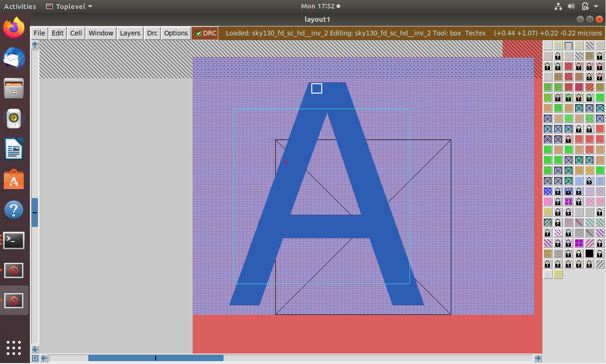
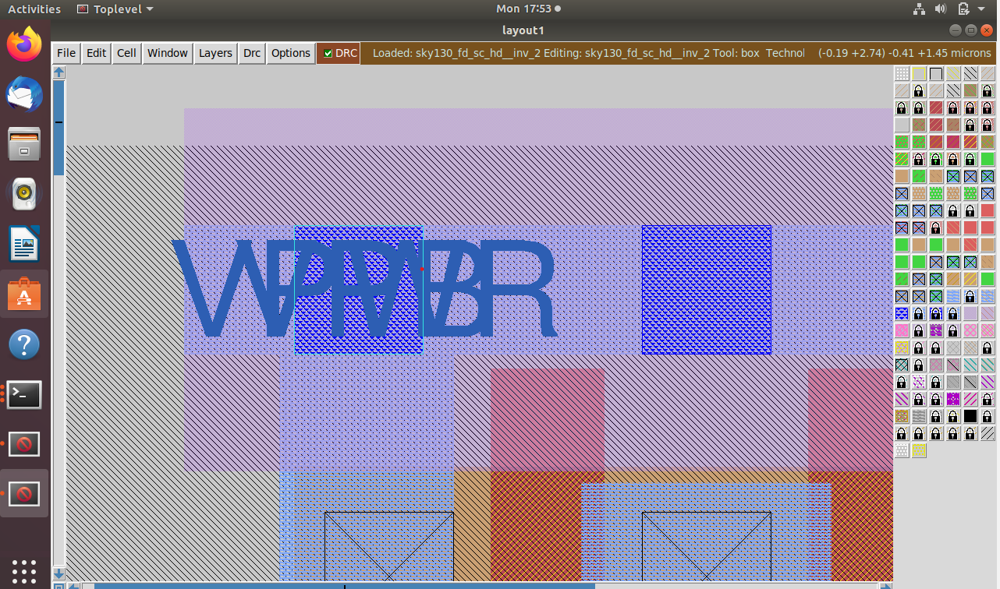
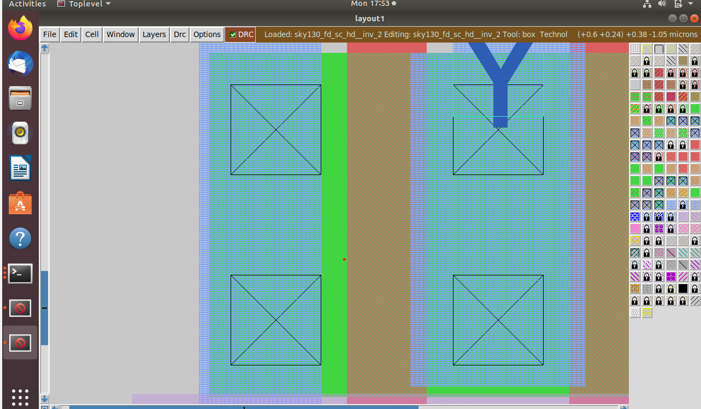
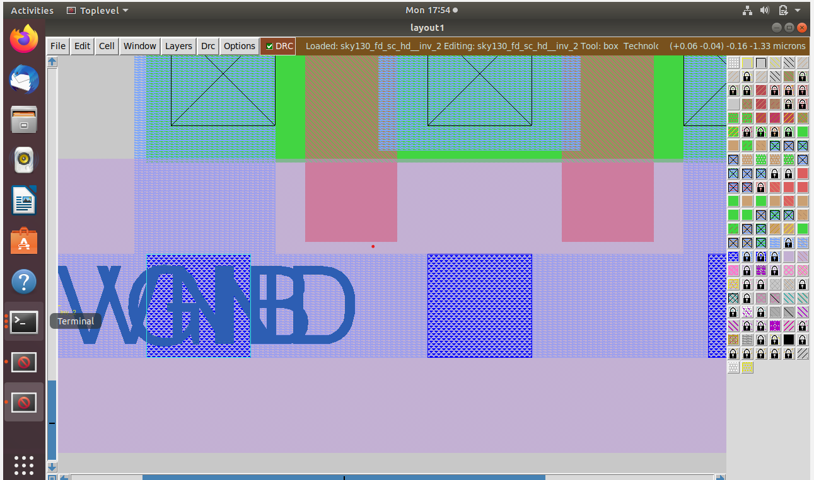

# Day 3 – Design Library Cell using Magic Layout and Characterization

## Objective
Design and analyze CMOS inverter layouts using Magic VLSI and study PMOS/NMOS device structures.

---

## CMOS Inverter Layout

### Inverter Layout

---

### NMOS Structure

---

### PMOS Structure

---

### Layout Observation 1

---

### Layout Observation 2

---

### Layout Observation 3

---

### Layout Observation 4

---

### Layout Observation 5

---

### Layout Observation 6

---

## Summary

- Explored CMOS inverter layout in Magic.
- Studied PMOS and NMOS regions.
- Observed routing, contacts, wells and layers.
- Verified layout visually through Magic VLSI.
