# Day 4 - Custom Standard Cell Design and OpenLANE Integration

## Objective

To design and analyze a CMOS inverter using Magic VLSI, extract its SPICE netlist, generate a LEF file, and integrate the custom standard cell into the OpenLANE physical design flow.

---

# 1. Opening CMOS Inverter Layout in Magic

The inverter layout was opened using Magic with the Sky130 technology file.

Command:

```bash
magic -T /home/vsduser/Desktop/work/tools/openlane_working_dir/pdks/sky130A/libs.tech/magic/sky130A.tech sky130_inv.mag &
```

Screenshot:

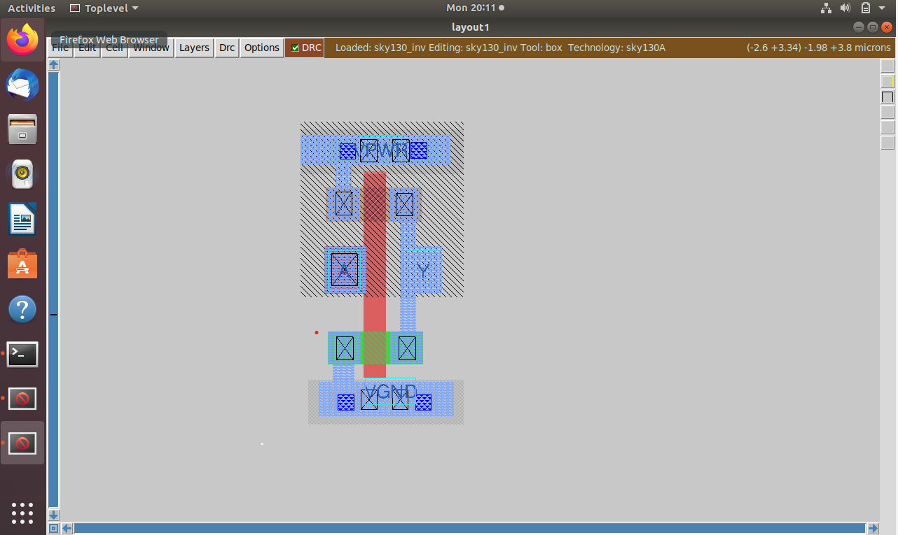

---

# 2. Device Verification and Grid Alignment

The PMOS and NMOS devices were inspected and routing track alignment was verified.

Commands:

```tcl
what
grid 0.46um 0.34um 0.23um 0.17um
```

Screenshots:

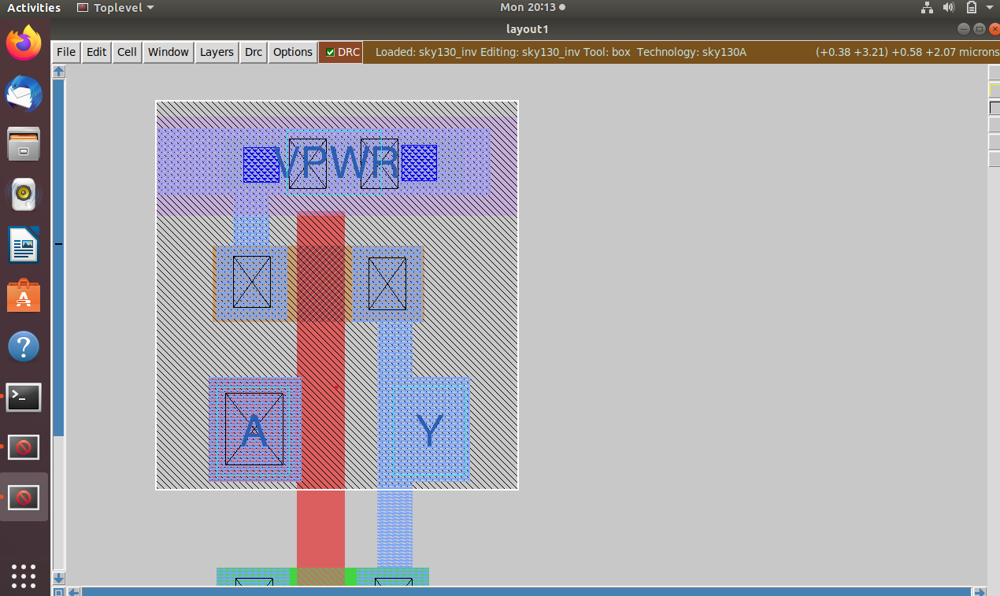

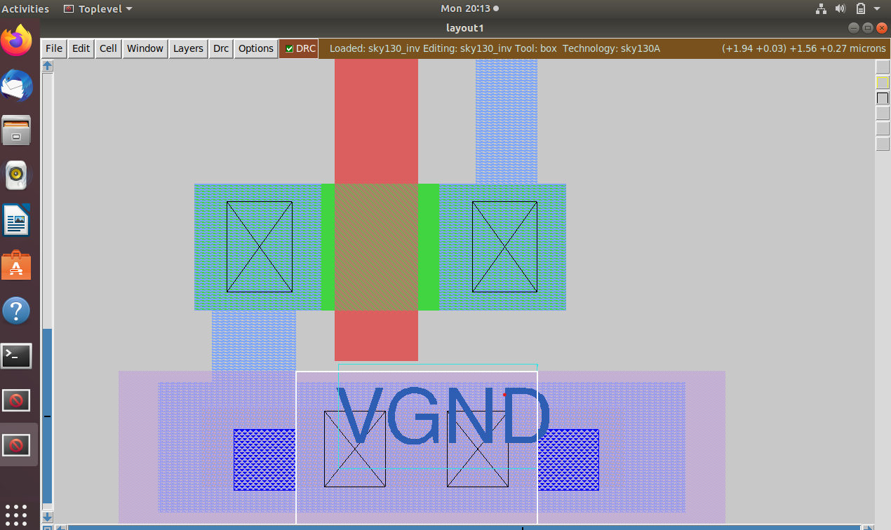

---

# 3. SPICE Extraction

The inverter layout was extracted to generate the SPICE netlist.

Commands:

```tcl
extract all
ext2spice cthresh 0 rthresh 0
ext2spice
```

Generated Files:

* sky130_inv.ext
* sky130_inv.spice

Screenshots:

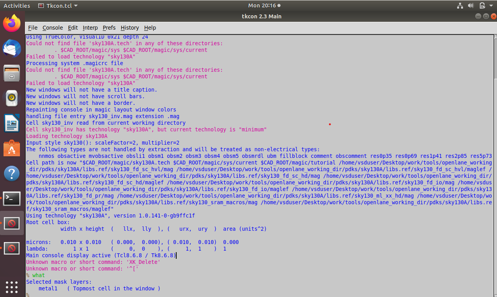

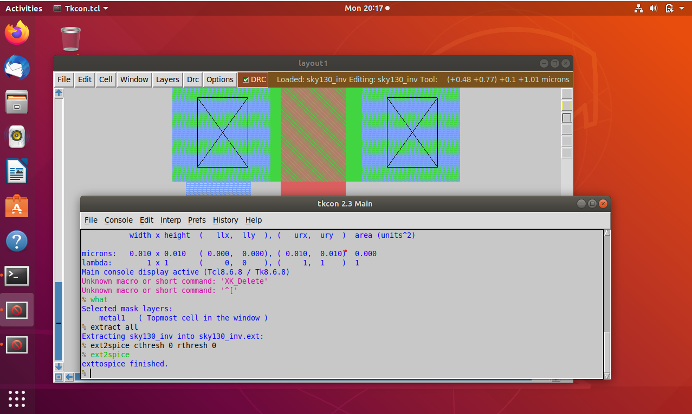

---

# 4. Netlist Verification

The generated SPICE netlist was checked to verify transistor connectivity and sizing.

Command:

```bash
grep "sky130_fd_pr" sky130_inv.spice
```

Observed Output:

```text
X0 Y A VGND VGND sky130_fd_pr__nfet_01v8 ...
X1 Y A VPWR VPWR sky130_fd_pr__pfet_01v8 ...
```

Screenshot:

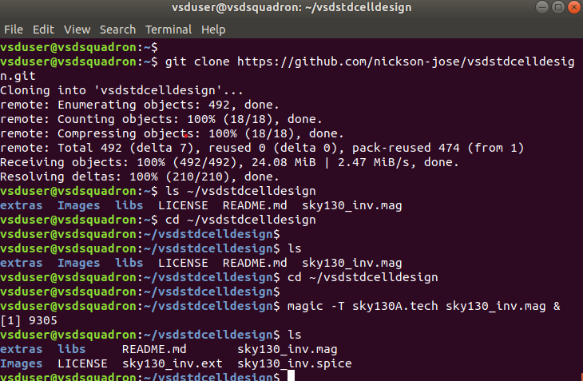

---

# 5. Saving Custom Standard Cell

The inverter layout was saved as a custom standard cell.

Command:

```tcl
save sky130_vsdinv.mag
```

Screenshot:

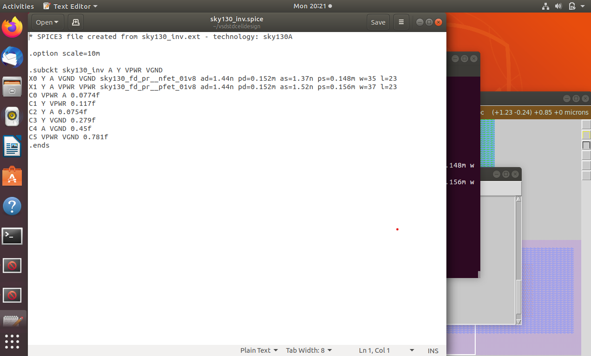

---

# 6. LEF Generation

A LEF file was generated from the custom inverter layout for OpenLANE integration.

Command:

```tcl
lef write
```

Generated File:

```text
sky130_vsdinv.lef
```

Screenshots:

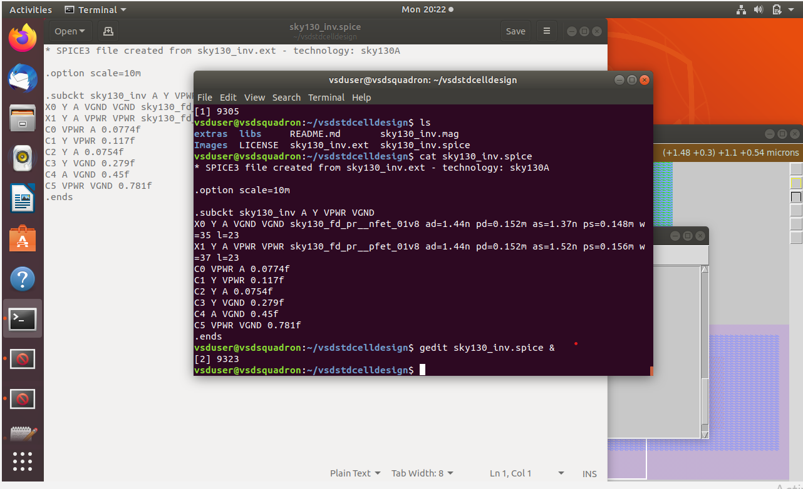

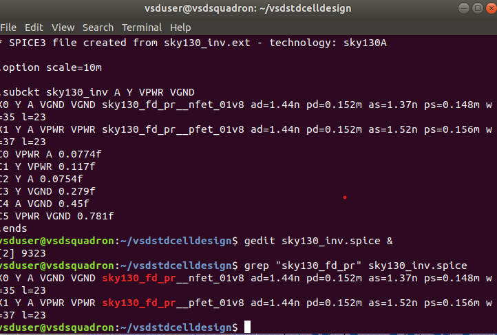

---

# 7. Copying LEF into OpenLANE Design

The generated LEF was copied into the picorv32a design source directory.

Command:

```bash
cp sky130_vsdinv.lef \
~/Desktop/work/tools/openlane_working_dir/openlane/designs/picorv32a/src/
```

Screenshot:

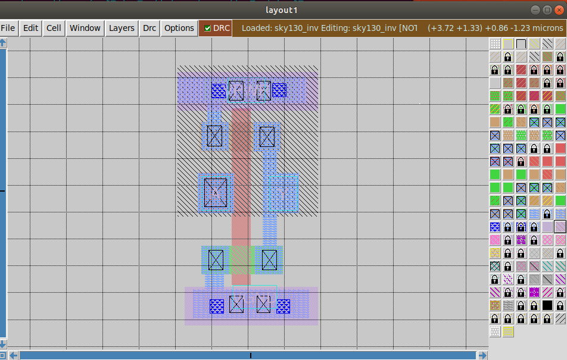

---

# 8. Launching OpenLANE

Commands:

```bash
docker
./flow.tcl -interactive
package require openlane
```

Screenshot:

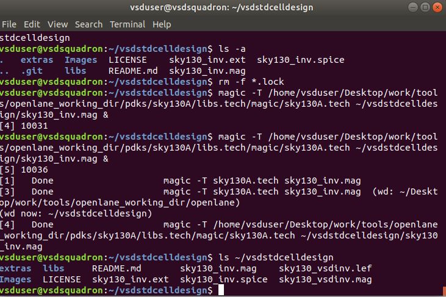

---

# 9. Preparing Design

Command:

```tcl
prep -design picorv32a -tag day4_run -overwrite
```

Screenshot:

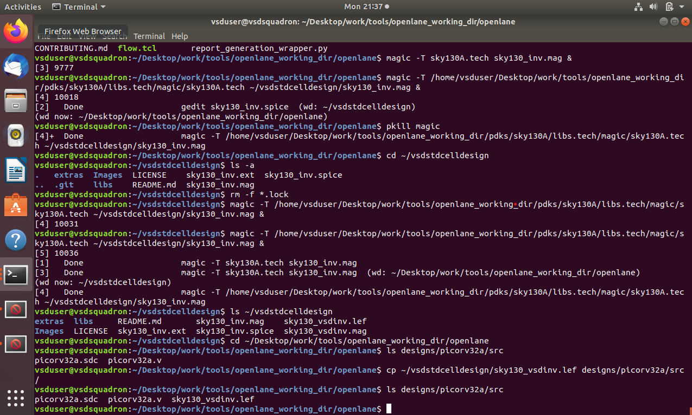

---

# 10. Adding Custom LEF

Commands:

```tcl
set lefs [glob $::env(DESIGN_DIR)/src/*.lef]
add_lefs -src $lefs
```

Screenshot:

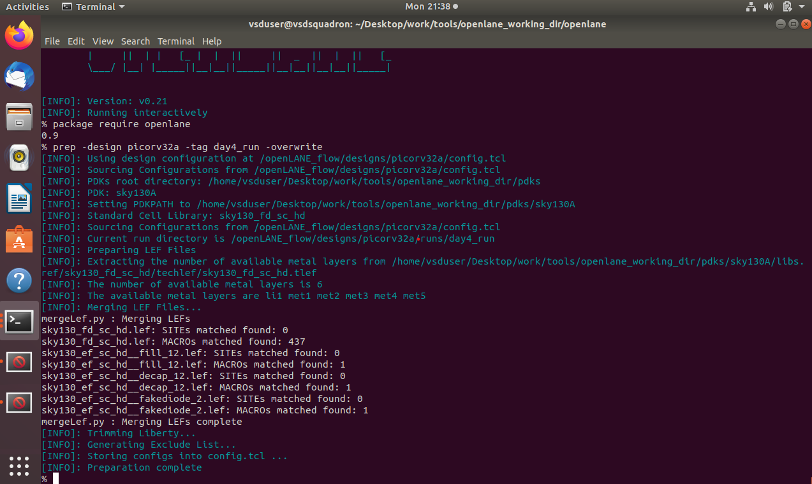

---

# 11. Logic Synthesis

Command:

```tcl
run_synthesis
```

Screenshot:

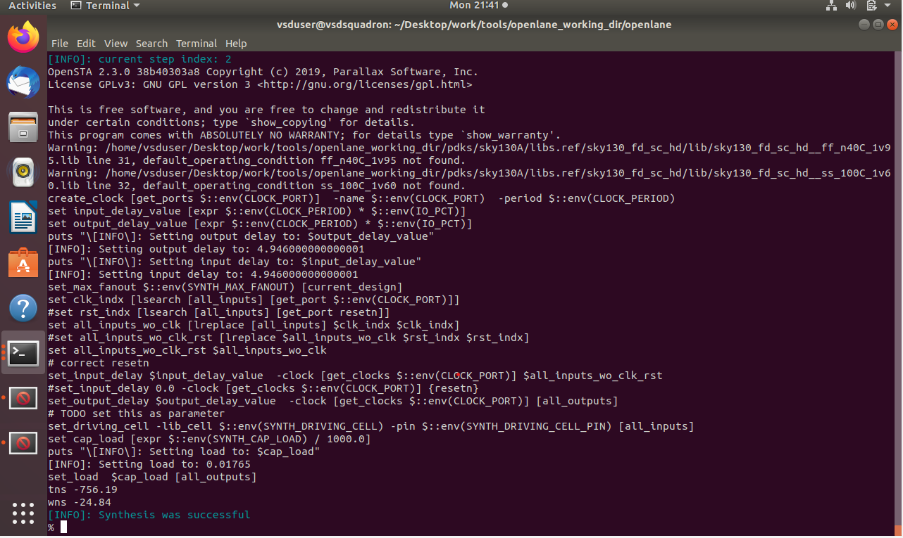

---

# 12. Floorplanning

Command:

```tcl
run_floorplan
```

Screenshot:

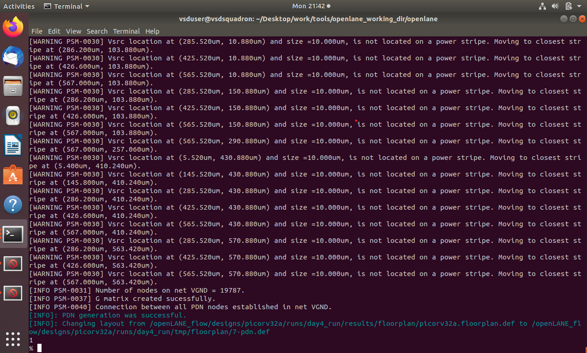

---

# 13. Placement

Command:

```tcl
run_placement
```

Screenshot:

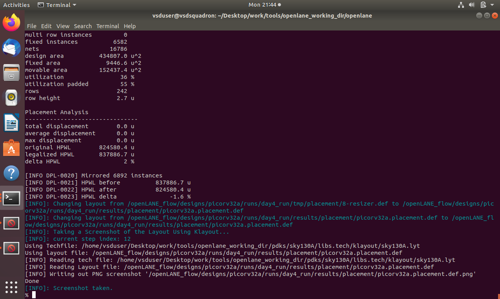

---

# 14. Clock Tree Synthesis (CTS)

Command:

```tcl
run_cts
```

Screenshot:

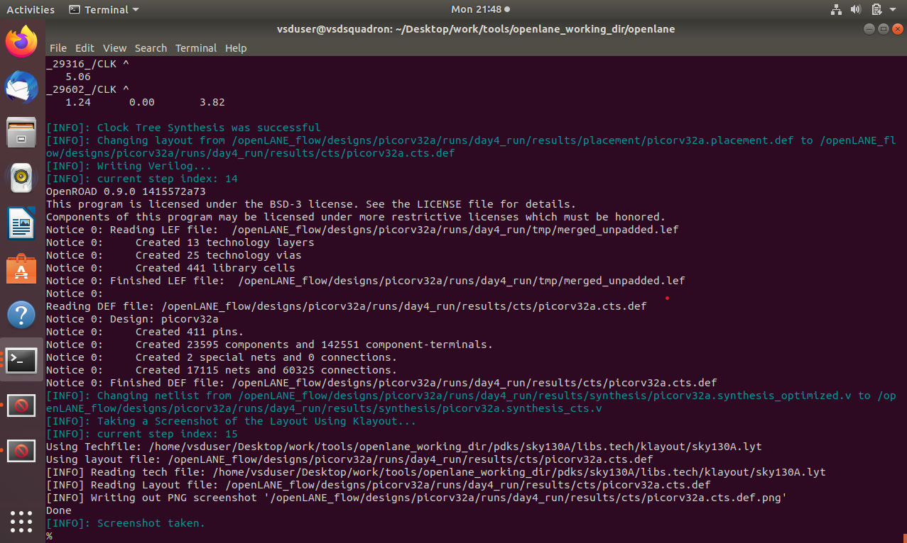

---

# 15. Verification of Generated DEF Files

Command:

```bash
find /openLANE_flow/designs/picorv32a/runs/day4_run/results -name "*.def"
```

Output:

```text
/openLANE_flow/designs/picorv32a/runs/day4_run/results/floorplan/picorv32a.floorplan.def
/openLANE_flow/designs/picorv32a/runs/day4_run/results/placement/picorv32a.placement.def
/openLANE_flow/designs/picorv32a/runs/day4_run/results/cts/picorv32a.cts.def
```

Screenshot:

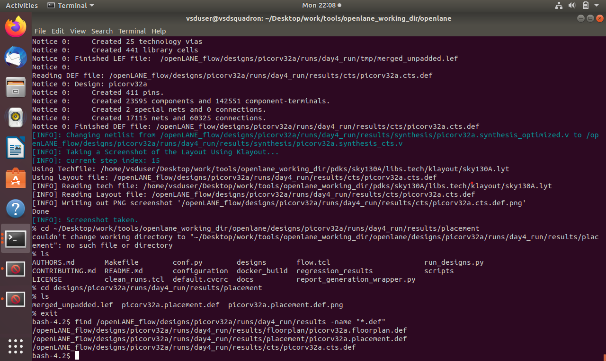

---

# Results

Successfully generated:

* sky130_inv.spice
* sky130_inv.ext
* sky130_vsdinv.mag
* sky130_vsdinv.lef
* picorv32a.floorplan.def
* picorv32a.placement.def
* picorv32a.cts.def

---

# Conclusion

Successfully designed a CMOS inverter using Magic VLSI, extracted the SPICE netlist, generated a LEF file, and integrated the custom standard cell into the OpenLANE flow. The design successfully completed synthesis, floorplanning, placement, and clock tree synthesis stages.

