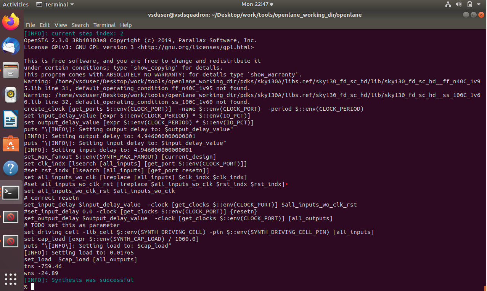
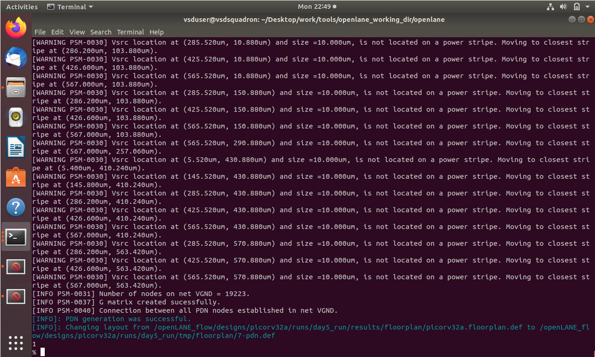
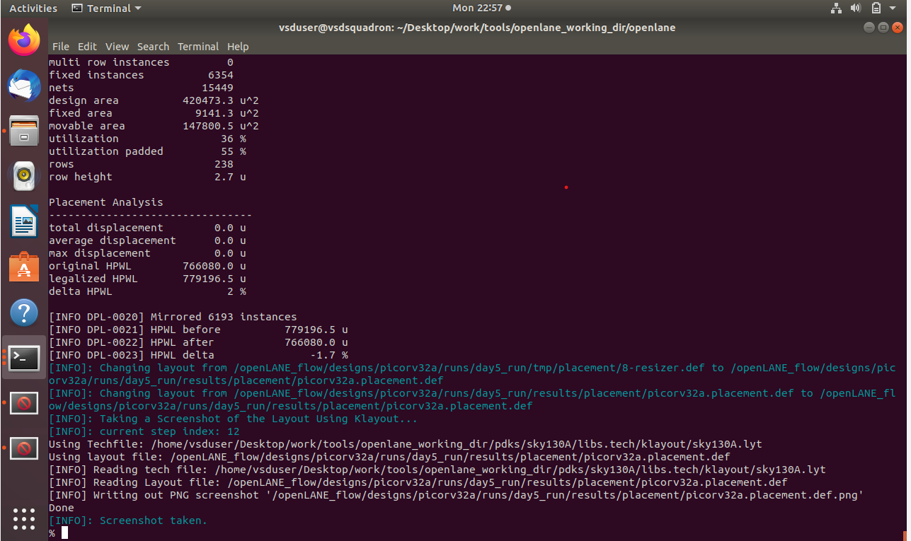
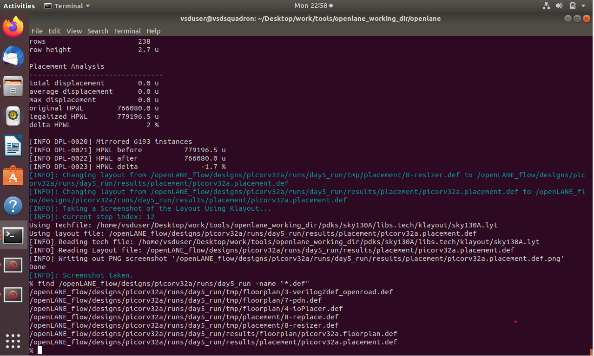
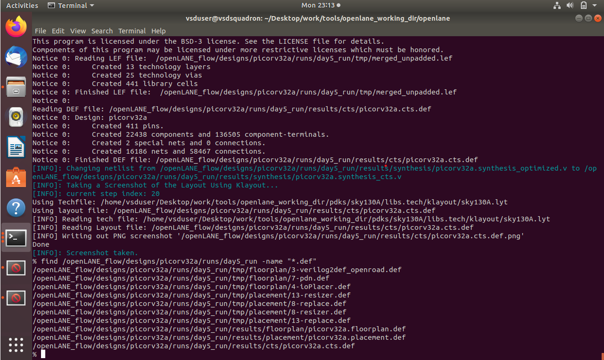
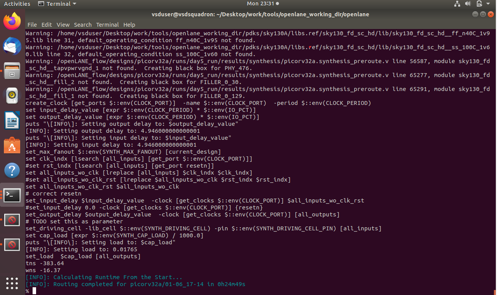
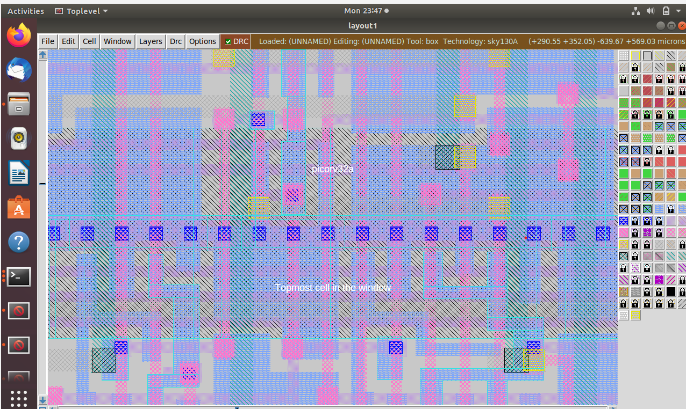
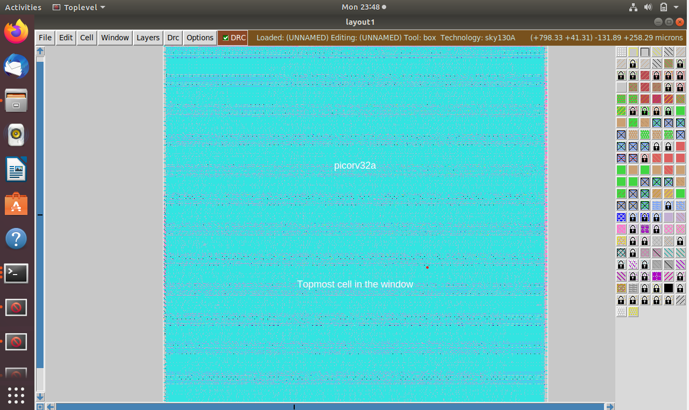

# Day 5 - OpenLANE Physical Design Flow

## Objective

To integrate the custom Sky130 inverter into the OpenLANE flow and perform synthesis, floorplanning, placement, clock tree synthesis (CTS), and routing for the picorv32a design.

---

## Tools Used

* OpenLANE
* OpenROAD
* Magic VLSI
* Sky130 PDK

---

## Design Preparation

The picorv32a design was prepared in OpenLANE using:

```tcl
prep -design picorv32a -tag day5_run -overwrite
```

Custom LEF files were added:

```tcl
set lefs [glob $::env(DESIGN_DIR)/src/*.lef]
add_lefs -src $lefs
```

---

## Synthesis

Command:

```tcl
run_synthesis
```

Screenshot:



---

## Floorplanning

Command:

```tcl
run_floorplan
```

Screenshot:



---

## Placement

Command:

```tcl
run_placement
```

Screenshot:



---

## Clock Tree Synthesis (CTS)

Command:

```tcl
run_cts
```

Screenshots:




---

## DEF Verification

Generated DEF files were verified:

* picorv32a.floorplan.def
* picorv32a.placement.def
* picorv32a.cts.def

Screenshot:



---

## Routing

Command:

```tcl
run_routing
```

Generated routed design:

* picorv32a.def

Screenshot:



---

## Routed Design Visualization in Magic

The routed DEF was loaded into Magic using:

```tcl
lef read merged.lef
def read picorv32a.def
select top cell
expand
```

Screenshots:





---

## Result

Successfully completed the OpenLANE physical design flow for the picorv32a design, including synthesis, floorplanning, placement, CTS, routing, and routed layout visualization.

---

## Conclusion

The custom standard cell was integrated into the OpenLANE flow and the design was successfully taken through the complete physical design stages up to routing using the Sky130 PDK.

